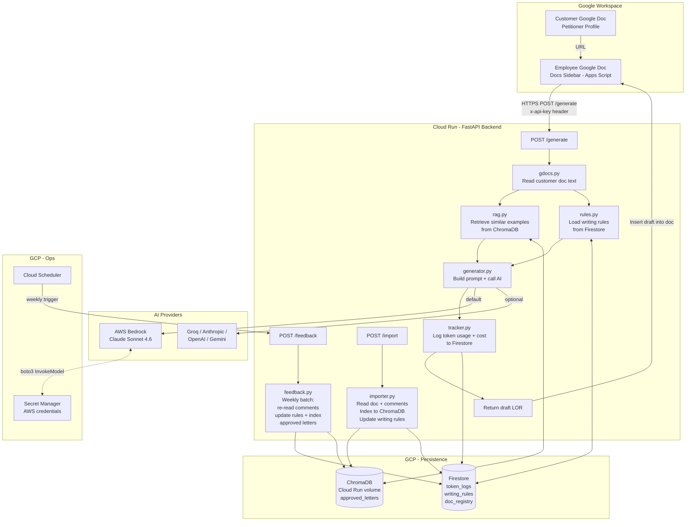

# LOR Automation — Architecture

This system generates AI-drafted Letters of Recommendation for US immigration petitions (EB-1A, EB-2 NIW, O-1A, OC) by combining a Google Docs sidebar UI with a Cloud Run FastAPI backend that retrieves RAG examples, applies team-lead writing rules, and calls an AI model (AWS Bedrock Claude Sonnet 4.6 by default, with optional Groq / Anthropic / OpenAI / Gemini fallback).

## Key Components

| Component | Technology | Role |
|-----------|-----------|------|
| Sidebar UI | Apps Script (`sidebar.html`, `Code.gs`) | Employee-facing form; calls `/generate`, inserts draft |
| Backend API | Cloud Run / FastAPI (`main.py`) | Routes: `/generate`, `/import`, `/feedback`, `/stats` |
| Generator | `generator.py` | Builds structured prompt; dispatches to AI provider |
| RAG Store | ChromaDB (`rag.py`) | Cosine-similarity search over approved past letters |
| Writing Rules | Firestore + `rules.py` | Per-LOR-type style rules updated from team-lead comments |
| Importer | `importer.py` | Bulk-loads historical docs into ChromaDB; extracts rules |
| Feedback Loop | `feedback.py` | Weekly Cloud Scheduler job; re-reads comments, improves rules |
| Cost Tracker | `tracker.py` + Firestore | Logs every generation: tokens, model, cost, employee |
| AI — Default | AWS Bedrock Claude Sonnet 4.6 | Primary generation model |
| AI — Optional | Groq / Anthropic / OpenAI / Gemini | Selectable per request via `ai_provider` field |
